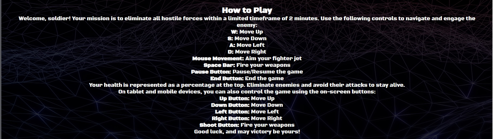

# Isolation - Jetfighter Shooter Website

Welcome to the Isolation Jetfighter Shooter website, where you can immerse yourself in an action-packed 2D JavaScript game. Take control of a fighter jet, eliminate hostile forces, and strive for victory in intense aerial battles.

## Table of Contents

- [Isolation - Jetfighter Shooter Website](#isolation---jetfighter-shooter-website)
 
  - [Table of Contents](#table-of-contents)
  - [Mission Log](#mission-log)
 
  - [How to Play](#how-to-play)
 
    - [Game Controls](#game-controls)
     
    - [Health and Survival](#health-and-survival)
    - [Mobile and Tablet Controls](#mobile-and-tablet-controls)
  - [Game Instructions](#game-instructions)
  - [Canvas for the Game](#canvas-for-the-game)
   
  - [Game Elements](#game-elements)
  - [Player Stats and Game Controls](#player-stats-and-game-controls)
  
  - [JavaScript Functionality](#javascript-functionality)
  - [Contact Information](#contact-information)
  - [Credits](#credits)

## Mission Log

Prepare for an adrenaline-filled mission! You are the last surviving member of your squad, stranded in enemy territory. Your objective: eliminate all hostile forces within a limited timeframe of 2 minutes. Your precision and resourcefulness will determine your success. Good luck, soldier!

## How to Play

Are you ready for action? Here's how you can play the game:

### Game Controls

- **W:** Move Up
- **S:** Move Down
- **A:** Move Left
- **D:** Move Right
- **Mouse Movement:** Aim your fighter jet
- **Space Bar:** Fire your weapons
- **Pause Button:** Pause/Resume the game
- **End Button:** End the game

### Health and Survival

Your health is displayed as a percentage at the top. Eliminate enemies and dodge their attacks to stay alive.

### Mobile and Tablet Controls

On tablet and mobile devices, you can control the game using on-screen buttons:

- **Up Button:** Move Up
- **Down Button:** Move Down
- **Left Button:** Move Left
- **Right Button:** Move Right
- **Shoot Button:** Fire your weapons

Good luck, and may victory be yours!

## Game Instructions

For a quick reference, you can show or hide the game instructions with the "Show Instructions" button.

## Canvas for the Game

The game is rendered within a canvas element with a width of 800 pixels and a height of 600 pixels.

## Game Elements

- **Fighter Jet Image:** The image of your fighter jet is used in the game.
- **Audio Elements:** Game sounds and background music are provided through audio elements.
- **Enemy Target Image:** The image of enemy targets is used in the game.

## Player Stats and Game Controls

- **Player Name:** Enter your name to start the game.
- **Start Button:** Begin the game.
- **Pause Button:** Pause the game.
- **Reset Button:** Reset the game.
- **End Button:** End the game.
- **Timer:** Shows the remaining time (02:00).
- **Health:** Displays your health (100%).
- **Score:** Keeps track of your score.
- **On-Screen Touch Control Buttons:** For mobile and tablet devices.

## JavaScript Functionality

The game functionality is powered by JavaScript, which is included in the `script.js` file.

#### Bugs

- The player's fighter jet may not respond correctly to touch gestures for aiming.
- [Intervention] Unable to preventDefault inside passive event listener due to target being treated as passive.
- Prolonged touch input may result in unexpected behavior, including the player going outside the game canvas.
- The reset button would only partly work by ending the game but not reloading the game into a fresh state.
- Player input name would not display after the user enters their name.
- When the payer dies the shooting sound keeps on playing.

#### Bugfixes

While I have identified several issues within the game, it's important to note that I have encountered some challenges in addressing these bugs. However, I have taken steps to document the code for readability and future improvements, ensuring that other developers can review the code and potentially find solutions to these issues.

Here's a summary of my efforts:

1. **Touch Control Issue:**
   - Despite my best efforts, I encountered difficulties in achieving precise touch control aiming on mobile and tablet devices. While the issue persists, I have documented the relevant code for further examination and potential improvements.

2. **Prevent Default Warning:**
   - I faced challenges in resolving the "preventDefault" warning related to passive event listeners. Although I couldn't eliminate this warning entirely, I have documented the code to provide insights for future development.

3. **Prolonged Touch Input Behavior:**
   - The unexpected behavior during prolonged touch input remains unresolved. Nevertheless, I have documented the code involved in touch event handling, which may aid in diagnosing and rectifying this issue.

4. **Reset Button Functionality:**
   - The reset button's partial functionality has not been fully resolved. I have documented the code for the reset button, allowing for potential future enhancements.

5. **Player Input Name Display:**
   - Despite our efforts, the issue with player input names not displaying has not been fixed. I have documented the code related to player names, which could assist in finding a solution.

6. **Endless Shooting Sound:**
   - The issue of continuous shooting sound after the player's death remains unresolved. I have documented the code related to audio management for reference in future fixes.

My commitment to improving the game experience remains steadfast. I appreciate your understanding and patience as I continue to work on addressing these challenges.

## Technologies Used

This project is built using the following technologies:

- **HTML:** The structure of the game and user interface is developed using HTML (Hypertext Markup Language), providing the foundation for the game's layout and content.

- **CSS:** Cascading Style Sheets (CSS) are used to style and design the game's appearance, including layouts, colors, fonts, and responsive design elements.

- **JavaScript:** The game functionality and interactivity are powered by JavaScript, enabling dynamic gameplay, user input handling, and game logic.

## Validation and Quality Assurance

I'm dedicated to maintaining the quality and reliability of my codebase. To ensure that my JavaScript code meets high coding standards and is free of potential errors, I validated it using JSHint ([jshint.com](https://jshint.com/)).

Key points regarding my JavaScript code validation:

- I used JSHint to analyze my JavaScript file, checking for syntax errors, coding conventions, and potential issues.

- My JavaScript code passes through JSHint validation with no warnings, demonstrating my commitment to clean and well-structured code.

I also conducted HTML and CSS validation using the W3C Markup Validation Service ([validator.w3.org](https://validator.w3.org/)) to ensure comprehensive quality assurance.

- Both my HTML and CSS pass through validation with no warnings or errors.

Thank you for choosing my game, and I hope you have a fantastic time playing it!

## Credits

- Fighter Jet Image: [Image Source](https://www.google.ie/)
- Background image and Game Canvas [Image Source](https://www.vecteezy.com/)
- Sound Effects: [Sound Source](https://pixabay.com/)
- Enemy Target Image: [Image Source](https://www.vecteezy.com/)
- Game Development: [Graham Walsh](https://grampers-dev.github.io/Isolation/)

