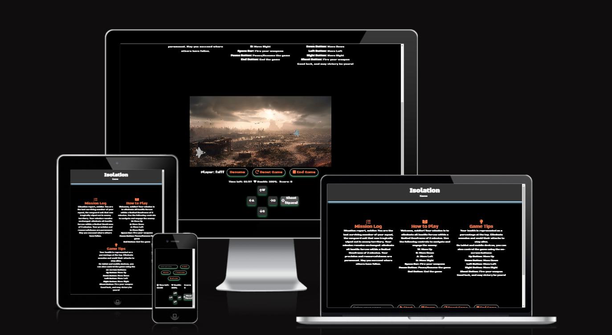
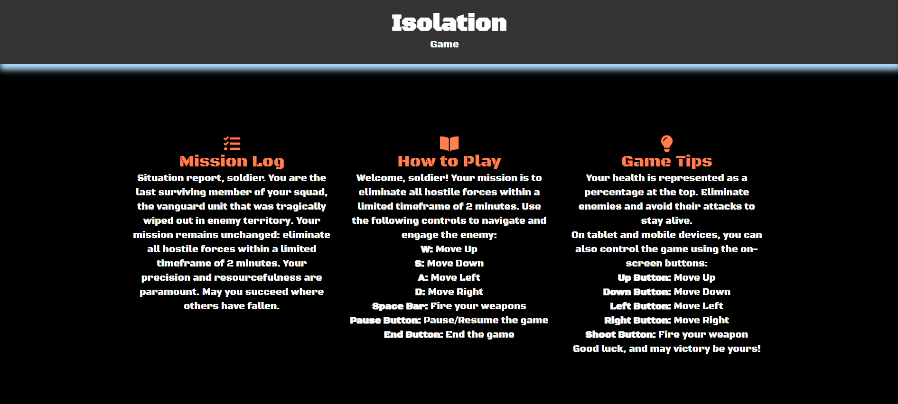
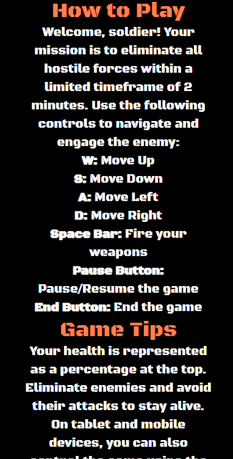
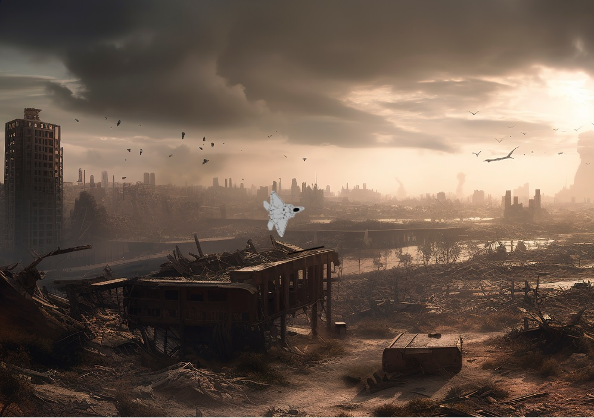
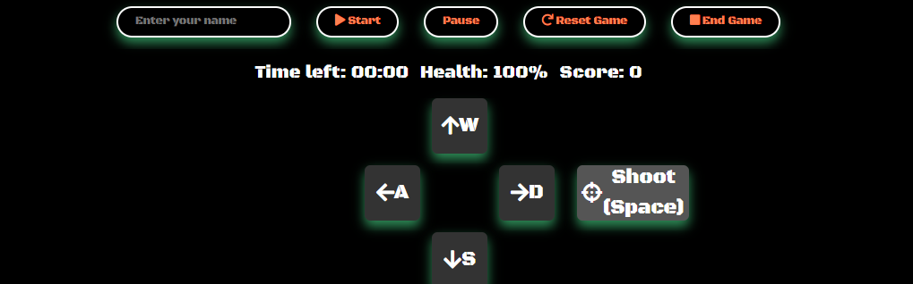

# Isolation - Jetfighter Shooter Website

Welcome to the Isolation Jetfighter Shooter website, where you can immerse yourself in an action-packed 2D JavaScript game. Take control of a fighter jet, eliminate hostile forces, and strive for victory in intense aerial battles.

## Table of Contents

- [Isolation - Jetfighter Shooter Website](#isolation---jetfighter-shooter-website)

  - [Table of Contents](#table-of-contents)
  - [Mission Log](#mission-log)
 []
  - [How to Play](#how-to-play)
 []
    - [Game Controls](#game-controls)
    []
    - [Health and Survival](#health-and-survival)
    - [Mobile and Tablet Controls](#mobile-and-tablet-controls)
  - [Game Instructions](#game-instructions)
  - [Canvas for the Game](#canvas-for-the-game)
  []
  - [Game Elements](#game-elements)
  - [Player Stats and Game Controls](#player-stats-and-game-controls)
  []
  - [JavaScript Functionality](#javascript-functionality)
    - [Bugs](#bugs)
    - [Bugfixes](#bugfixes)
      - [Efforts to Address Bugs:](#efforts-to-address-bugs)
    - [Update](#update)
  - [Technologies Used](#technologies-used)
  - [Validation and Quality Assurance](#validation-and-quality-assurance)
  - [Deployment](#deployment)
    - [Deploy to GitHub Pages](#deploy-to-github-pages)
    - [Fork the Repository](#fork-the-repository)
    - [Create a Local Clone](#create-a-local-clone)
  - [Credits](#credits)
  - [Code Update Summary](#code-update-summary)
    - [Overview of Key Changes and Improvements](#overview-of-key-changes-and-improvements)
      - [DOM Element Variables](#dom-element-variables)
      - [Volume Levels](#volume-levels)
    - [Gunner Object](#gunner-object)
    - [Functions](#functions)
      - [Draw Gunner](#draw-gunner)
      - [Draw Bullets and Targets](#draw-bullets-and-targets)
      - [Handle Input](#handle-input)
      - [Handle Collisions](#handle-collisions)
      - [Game Loop](#game-loop)
    - [Event Listeners](#event-listeners)
      - [Keyboard Events](#keyboard-events)
      - [Touch Events](#touch-events)
    - [Game Mechanics](#game-mechanics)
      - [Start Game](#start-game)
      - [End Game](#end-game)
      - [Reset Game](#reset-game)
    - [Timer and Interval Management](#timer-and-interval-management)
      - [Update Timer](#update-timer)
      - [Shooting and Spawning Targets](#shooting-and-spawning-targets)
    - [Error Handling](#error-handling)
      - [Audio Play](#audio-play)
    - [Detailed Code Review](#detailed-code-review)
      - [Documentation and References](#documentation-and-references)
      - [Gunner Object Enhancements](#gunner-object-enhancements)
      - [Game Initialization](#game-initialization)
      - [Event Listeners for Buttons and Touch Controls](#event-listeners-for-buttons-and-touch-controls)
      - [Canvas and Context Handling](#canvas-and-context-handling)
      - [Game Loop and Update Function](#game-loop-and-update-function)
      - [Collision Handling](#collision-handling)
      - [Audio Management](#audio-management)
      - [Player Input Handling](#player-input-handling)
      - [Timer and Game State Management](#timer-and-game-state-management)
      - [Game Control Functions](#game-control-functions)
      - [Drawing Functions](#drawing-functions)
    - [Conclusion](#conclusion)
  - [Use of MDN Documentation](#use-of-mdn-documentation)
  - [Attributions](#attributions)

## Mission Log

Prepare for an adrenaline-filled mission! You are the last surviving member of your squad, stranded in enemy territory. Your objective: eliminate all hostile forces within a limited timeframe of 2 minutes. Your precision and resourcefulness will determine your success. Good luck, soldier!

## How to Play

Are you ready for action? Here's how you can play the game:

### Game Controls

- **W:** Move Up
- **S:** Move Down
- **A:** Move Left
- **D:** Move Right
- **Mouse Movement:** Aim your fighter jet
- **Space Bar:** Fire your weapons
- **Pause Button:** Pause/Resume the game
- **End Button:** End the game

### Health and Survival

Your health is displayed as a percentage at the top. Eliminate enemies and dodge their attacks to stay alive.

### Mobile and Tablet Controls

On tablet and mobile devices, you can control the game using on-screen buttons:

- **Up Button:** Move Up
- **Down Button:** Move Down
- **Left Button:** Move Left
- **Right Button:** Move Right
- **Shoot Button:** Fire your weapon
- Shooting is also achieved by pressing on the canvas

Good luck, and may victory be yours!

## Canvas for the Game

The game is rendered within a canvas element with a width of 800 pixels and a height of 600 pixels.

## Game Elements

- **Fighter Jet Image:** The image of your fighter jet is used in the game.
- **Audio Elements:** Game sounds and background music are provided through audio elements.
- **Enemy Target Image:** The image of enemy targets is used in the game.

## Player Stats and Game Controls

- **Player Name:** Enter your name to start the game.
- **Start Button:** Begin the game.
- **Pause Button:** Pause the game.
- **Reset Button:** Reset the game.
- **End Button:** End the game.
- **Timer:** Shows the remaining time (02:00).
- **Health:** Displays your health (100%).
- **Score:** Keeps track of your score.
- **On-Screen Touch Control Buttons:** For mobile and tablet devices.

## JavaScript Functionality

The game functionality is powered by JavaScript, which is included in the `script.js` file.

### Bugs

- The player's fighter jet may not respond correctly to touch gestures for aiming.
- [Intervention] Unable to preventDefault inside passive event listener due to target being treated as passive.
- Prolonged touch input may result in unexpected behavior, including the player going outside the game canvas.
- The reset button would only partly work by ending the game but not reloading the game into a fresh state.
- Player input name would not display after the user enters their name.
- When the player dies, the shooting sound keeps on playing.

### Bugfixes / Resubmission update

While several issues within the game remain, I have documented the code for readability and future improvements, ensuring that other developers can review the code and potentially find solutions.

#### Efforts to Address Bugs

1. **Touch Control Issue:**
   - Difficulty in achieving precise touch control aiming on mobile and tablet devices.
   - Documented relevant code for further examination and potential improvements.

2. **Prevent Default Warning:**
   - Challenges in resolving the "preventDefault" warning related to passive event listeners.
   - Documented the code to provide insights for future development.

3. **Prolonged Touch Input Behavior:**
   - Unexpected behavior during prolonged touch input remains unresolved.
   - Documented the code involved in touch event handling for diagnosing and rectifying this issue.

4. **Reset Button Functionality:**
   - The reset button's partial functionality has not been fully resolved.
   - Documented the code for the reset button, allowing for potential future enhancements.
  
### Update
  
- I applied fixes for this where the shooting sound stops and the game reloads correctly.
- Users can re-start the game now.

1. **Player Input Name Display:**
   - Issue with player input names not displaying remains unresolved.
   - Documented the code related to player names to assist in finding a solution.

2. **Endless Shooting Sound:**
   - Issue of continuous shooting sound after the player's death remains unresolved.
   - Documented the code related to audio management for reference in future fixes.

## Technologies Used

This project is built using the following technologies:

- **HTML:** Structure of the game and user interface.
- **CSS:** Styling and design of the game's appearance, including layouts, colors, fonts, and responsive design elements.
- **JavaScript:** Game functionality and interactivity, enabling dynamic gameplay, user input handling, and game logic.

## Validation and Quality Assurance

Ensuring the quality and reliability of the codebase through validation and testing:

- **JavaScript:** Validated using JSHint ([jshint.com](https://jshint.com/)). The code passes with no warnings.
- **HTML and CSS:** Validated using the W3C Markup Validation Service ([validator.w3.org](https://validator.w3.org/)).

## Deployment

### Deploy to GitHub Pages

The site was deployed to GitHub Pages:

1. Go to Settings in the repository.
2. Navigate to the **Pages** tab.
3. Under **Source**, select the branch (e.g., **main**), then click **save**.
4. The page will refresh with a ribbon display indicating the successful deployment.

### Fork the Repository

To fork the repository:

1. Log in to **GitHub** and locate the [repository](https://github.com/Grampers-Dev/Isolation).
2. Click the **'Fork'** button on the right-hand side to create a copy of the repository in your GitHub account.

### Create a Local Clone

To clone the repository:

1. Click on the **code** tab in the repository.
2. Copy the URL in the **Clone with HTTPS** section.
3. Open **Git Bash** in your IDE.
4. Change the current working directory to the desired location for the clone.
5. Type `git clone` and paste the copied URL.
6. Press **enter** to create the local clone.

The live link to the GitHub repository: <https://grampers-dev.github.io/Isolation/>

## Credits

- Fighter Jet Image: [Image Source](https://www.google.ie/)
- Background image and Game Canvas: [Image Source](https://www.vecteezy.com/)
- Sound Effects: [Sound Source](https://pixabay.com/)
- Enemy Target Image: [Image Source](https://www.vecteezy.com/)
- Game Development: [Graham Walsh](https://grampers-dev.github.io/Isolation/)

## Code Update Summary

### Overview of Key Changes and Improvements

The significant changes and improvements I made to the JavaScript code for better readability, maintainability, and performance:

#### DOM Element Variables

- Grouped similar elements together with comments explaining their purpose.
- Organized references to the DOM elements with comments and links to relevant documentation.

#### Volume Levels

- Set volume levels for `backgroundMusic` and `backgroundMusic2` differently.

### Gunner Object

- Added properties `movingLeft` and `movingRight` for movement, and `shootingDirection` to handle shooting direction.
- Set the initial position of the gunner to the left edge of the canvas.

### Functions

#### Draw Gunner

- Improved comments and references to documentation for each method used.

#### Draw Bullets and Targets

- Consistent use of comments and documentation references for each step.

#### Handle Input

- Added bounds checking to ensure the gunner does not move outside the canvas.

#### Handle Collisions

- Improved comments and references to collision detection techniques and resources.

#### Game Loop

- Added a check to set `gameIsRunning` to `true` when the game starts and incorporated error handling for audio play.

### Event Listeners

#### Keyboard Events

- Combined keydown and keyup event listeners to handle movement and shooting.

#### Touch Events

- Added event listeners for touchstart and touchend events with improved comments and references.
- Added passive options to touch event listeners to improve performance.

### Game Mechanics

#### Start Game

- Improved comments and references for each step, added error handling for audio play, and updated game state management.

#### End Game

- Included error handling and improved comments for cleanup tasks.

#### Reset Game

- Improved comments and reset state management for a fresh start.

### Timer and Interval Management

#### Update Timer

- Enhanced comments for better understanding of the timing calculations and formatting.

#### Shooting and Spawning Targets

- Improved comments, added references, and managed the spawning of targets and shooting actions.

### Error Handling

#### Audio Play

- Added error handling for audio playback to ensure smooth user experience.

### Detailed Code Review

#### Documentation and References

- Added detailed comments and references to MDN documentation for various methods and properties, improving code readability and maintainability.

#### Gunner Object Enhancements

- Added `movingLeft` and `movingRight` properties to the `gunner` object.
- Included `shootingDirection` to handle the shooting direction.

#### Game Initialization

- Moved the initialization of the leaderboard array inside the DOM element variables section.
- Added a constant `speedIncrement` to control the speed increment of targets.

#### Event Listeners for Buttons and Touch Controls

- Improved event listeners for buttons and touch controls with passive event options to enhance performance.
- Added detailed comments and MDN references for each event listener.

#### Canvas and Context Handling

- Added more detailed comments and references for `canvas` and `ctx` operations.

#### Game Loop and Update Function

- Improved the `update` function with more detailed comments and better structuring of tasks like handling input, drawing elements, and updating positions.
- The `gameLoop` function now checks `isPaused` and `isGameOver` states before calling `update`.

#### Collision Handling

- Simplified collision detection logic with improved comments and references to MDN and game development resources.
- Added a new collision handling method for both player and enemy bullets.

#### Audio Management

- Added error handling for audio playback to ensure smooth user experience.
- Improved comments for audio elements and playback logic.

#### Player Input Handling

- Enhanced `handleInput` function to ensure the gunner stays within canvas bounds.
- Improved comments and added references for handling keyboard and touch events.

#### Timer and Game State Management

- Improved `updateTimer` function with detailed comments and MDN references for date and time calculations.
- Reset game intervals and timeouts more efficiently in the `resetGame` function.

#### Game Control Functions

- Enhanced `startGame`, `endGame`, and `resetGame` functions with better state management and more detailed comments.
- Ensured proper cleanup and resetting of game states and elements.

#### Drawing Functions

- Added detailed comments for `drawGunner`, `drawBullets`, and `drawTargets` functions.
- Improved the drawing logic to handle various transformations and state changes.

### Conclusion

The updated code is significantly more maintainable, readable, and efficient. It incorporates comprehensive documentation and references to MDN, ensuring that other developers can easily understand and extend the game. The improvements in state management, collision detection, and input handling contribute to a smoother gameplay experience.

## Use of MDN Documentation

Throughout the development of this project, I made extensive use of the Mozilla Developer Network (MDN) documentation to ensure that my code is based on best practices and industry standards. Here are some key areas where MDN documentation was particularly helpful:

1. **Canvas and 2D Context:**
   - [CanvasRenderingContext2D](https://developer.mozilla.org/en-US/docs/Web/API/CanvasRenderingContext2D)
   - [Canvas API/Tutorial/Drawing_shapes](https://developer.mozilla.org/en-US/docs/Web/API/Canvas_API/Tutorial/Drawing_shapes)

2. **DOM Manipulation:**
   - [Document.querySelector](https://developer.mozilla.org/en-US/docs/Web/API/Document/querySelector)

3. **Image and Media Elements:**
   - [HTMLImageElement/Image](https://developer.mozilla.org/en-US/docs/Web/API/HTMLImageElement/Image)
   - [HTMLMediaElement/volume](https://developer.mozilla.org/en-US/docs/Web/API/HTMLMediaElement/volume)
   - [HTMLMediaElement/pause](https://developer.mozilla.org/en-US/docs/Web/API/HTMLMediaElement/pause)
   - [HTMLMediaElement/play](https://developer.mozilla.org/en-US/docs/Web/API/HTMLMediaElement/play)

4. **Event Handling:**
   - [Element/keydown_event](https://developer.mozilla.org/en-US/docs/Web/API/Element/keydown_event)
   - [Element/keyup_event](https://developer.mozilla.org/en-US/docs/Web/API/Element/keyup_event)
   - [Touch_events](https://developer.mozilla.org/en-US/docs/Web/API/Touch_events)

5. **Animation and Timing:**
   - [window/requestAnimationFrame](https://developer.mozilla.org/en-US/docs/Web/API/window/requestAnimationFrame)
   - [WindowOrWorkerGlobalScope/setInterval](https://developer.mozilla.org/en-US/docs/Web/API/WindowOrWorkerGlobalScope/setInterval)
   - [WindowOrWorkerGlobalScope/clearInterval](https://developer.mozilla.org/en-US/docs/Web/API/WindowOrWorkerGlobalScope/clearInterval)

6. **Mathematics and Utility Functions:**
   - [Math/atan2](https://developer.mozilla.org/en-US/docs/Web/JavaScript/Reference/Global_Objects/Math/atan2)
   - [Math/random](https://developer.mozilla.org/en-US/docs/Web/JavaScript/Reference/Global_Objects/Math/random)
   - [Math/floor](https://developer.mozilla.org/en-US/docs/Web/JavaScript/Reference/Global_Objects/Math/floor)
   - [Array/push](https://developer.mozilla.org/en-US/docs/Web/JavaScript/Reference/Global_Objects/Array/push)
   - [Array/splice](https://developer.mozilla.org/en-US/docs/Web/JavaScript/Reference/Global_Objects/Array/splice)
   - [Date/getTime](https://developer.mozilla.org/en-US/docs/Web/JavaScript/Reference/Global_Objects/Date/getTime)
   - [String/padStart](https://developer.mozilla.org/en-US/docs/Web/JavaScript/Reference/Global_Objects/String/padStart)

By leveraging MDN's comprehensive and authoritative resources, I was able to implement features with confidence, knowing that I was following the latest web standards and best practices. MDN documentation provided invaluable guidance on a wide range of topics, from basic DOM manipulation to complex canvas operations, ensuring that the codebase is robust and maintainable.

## Attributions

1. [CanvasRenderingContext2D](https://developer.mozilla.org/en-US/docs/Web/API/CanvasRenderingContext2D)
2. [Document.querySelector](https://developer.mozilla.org/en-US/docs/Web/API/Document/querySelector)
3. [HTMLImageElement/Image](https://developer.mozilla.org/en-US/docs/Web/API/HTMLImageElement/Image)
4. [HTMLMediaElement/volume](https://developer.mozilla.org/en-US/docs/Web/API/HTMLMediaElement/volume)
5. [CanvasRenderingContext2D/save](https://developer.mozilla.org/en-US/docs/Web/API/CanvasRenderingContext2D/save)
6. [CanvasRenderingContext2D/translate](https://developer.mozilla.org/en-US/docs/Web/API/CanvasRenderingContext2D/translate)
7. [CanvasRenderingContext2D/rotate](https://developer.mozilla.org/en-US/docs/Web/API/CanvasRenderingContext2D/rotate)
8. [CanvasRenderingContext2D/drawImage](https://developer.mozilla.org/en-US/docs/Web/API/CanvasRenderingContext2D/drawImage)
9. [CanvasRenderingContext2D/fillStyle](https://developer.mozilla.org/en-US/docs/Web/API/CanvasRenderingContext2D/fillStyle)
10. [CanvasRenderingContext2D/fillRect](https://developer.mozilla.org/en-US/docs/Web/API/CanvasRenderingContext2D/fillRect)
11. [CanvasRenderingContext2D/restore](https://developer.mozilla.org/en-US/docs/Web/API/CanvasRenderingContext2D/restore)
12. [Canvas API/Tutorial/Drawing_shapes](https://developer.mozilla.org/en-US/docs/Web/API/Canvas_API/Tutorial/Drawing_shapes)
13. [CanvasRenderingContext2D/clearRect](https://developer.mozilla.org/en-US/docs/Web/API/CanvasRenderingContext2D/clearRect)
14. [KeyboardEvent](https://developer.mozilla.org/en-US/docs/Web/API/KeyboardEvent)
15. [2D collision detection](https://developer.mozilla.org/en-US/docs/Games/Techniques/2D_collision_detection)
16. [Separating Axis Theorem](https://gamedevelopment.tutsplus.com/tutorials/quick-tip-collision-detection-with-the-separating-axis-theorem--gamedev-169)
17. [Bounding Box Intersection](https://gamedev.stackexchange.com/questions/586/what-is-the-fastest-way-to-work-out-2d-bounding-box-intersection)
18. [window/requestAnimationFrame](https://developer.mozilla.org/en-US/docs/Web/API/window/requestAnimationFrame)
19. [Date/getTime](https://developer.mozilla.org/en-US/docs/Web/JavaScript/Reference/Global_Objects/Date/getTime)
20. [Math/max](https://developer.mozilla.org/en-US/docs/Web/JavaScript/Reference/Global_Objects/Math/max)
21. [String/padStart](https://developer.mozilla.org/en-US/docs/Web/JavaScript/Reference/Global_Objects/String/padStart)
22. [WindowOrWorkerGlobalScope/setInterval](https://developer.mozilla.org/en-US/docs/Web/API/WindowOrWorkerGlobalScope/setInterval)
23. [WindowOrWorkerGlobalScope/clearInterval](https://developer.mozilla.org/en-US/docs/Web/API/WindowOrWorkerGlobalScope/clearInterval)
24. [HTMLMediaElement/pause](https://developer.mozilla.org/en-US/docs/Web/API/HTMLMediaElement/pause)
25. [HTMLMediaElement/play](https://developer.mozilla.org/en-US/docs/Web/API/HTMLMediaElement/play)
26. [HTMLButtonElement/disabled](https://developer.mozilla.org/en-US/docs/Web/API/HTMLButtonElement/disabled)
27. [HTMLElement/style](https://developer.mozilla.org/en-US/docs/Web/API/HTMLElement/style)
28. [Element/keydown_event](https://developer.mozilla.org/en-US/docs/Web/API/Element/keydown_event)
29. [Element/keyup_event](https://developer.mozilla.org/en-US/docs/Web/API/Element/keyup_event)
30. [Touch_events](https://developer.mozilla.org/en-US/docs/Web/API/Touch_events)
31. [CanvasRenderingContext2D/fillText](https://developer.mozilla.org/en-US/docs/Web/API/CanvasRenderingContext2D/fillText)
32. [HTMLMediaElement/currentTime](https://developer.mozilla.org/en-US/docs/Web/API/HTMLMediaElement/currentTime)
33. [Math/atan2](https://developer.mozilla.org/en-US/docs/Web/JavaScript/Reference/Global_Objects/Math/atan2)
34. [Math/random](https://developer.mozilla.org/en-US/docs/Web/JavaScript/Reference/Global_Objects/Math/random)
35. [Math/floor](https://developer.mozilla.org/en-US/docs/Web/JavaScript/Reference/Global_Objects/Math/floor)
36. [Array/push](https://developer.mozilla.org/en-US/docs/Web/JavaScript/Reference/Global_Objects/Array/push)
37. [Array/splice](https://developer.mozilla.org/en-US/docs/Web/JavaScript/Reference/Global_Objects/Array/splice)
